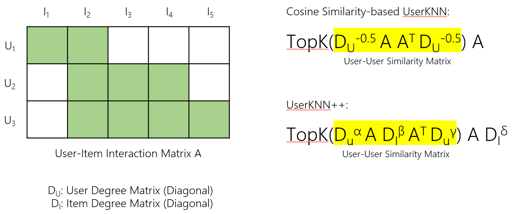

## [Implicit Collaborative Filtering](https://en.wikipedia.org/wiki/Collaborative_filtering)
---
Implicit collaborative filtering is based on implicit observations of normal user behavior (as opposed to the artificial behavior imposed by a rating task). These systems observe what a user has done together with what all users have done (what music they have listened to, what items they have bought) and use that data to predict the user's behavior in the future, or to predict how a user might like to behave given the chance. These predictions then have to be filtered through business logic to determine how they might affect the actions of a business system. For example, it is not useful to offer to sell somebody a particular album of music if they already have demonstrated that they own that music.

## Efficiency Improvements
---
- 많은 코드에서 Interaction 단위로 Negative Sampling을 수행하지만, 이 경우 Negative Sampling에서 Bottleneck이 발생하며 CPU를 많이 사용한다. 이를 완화하기 위해 Negative Sampling을 유저 배치 단위로 수행하도록 구현하였으며, 이를 병렬적으로 처리하기 위해 GPU Tensor Indexing을 이용하였다.
- LightGCN의 Message Passing 연산에 Sparse Tensor를 이용하여 메모리 사용을 줄이고 속도를 향상시켰다.
- 학습을 전혀 하지 않는 KNN을 변형하여 효율적이고 효과적인 KNN++를 고안하였다. 배치 단위로 구현하여 GPU에서 빠른 속도로 예측할 수 있다. 
- 많은 코드에서 유저 단위로 모델의 정확도를 평가하지만, 이 경우 모델 평가에서 Bottleneck이 발생한다. 이를 완화하기 위해 유저 배치 단위로 모델을 평가하도록 구현하였으며, Score Matrix 정렬, Top-k Metric 계산 등을 GPU에서 병렬적으로 처리하므로 효율적이다.

## Key Findings
---
- 데이터셋의 특성(e.g., Density)에 따라 모델 정확도의 경향성이 크게 바뀐다.
- 모델 구조보다 Negative Sample의 수, Loss Function, Weight Decay와 같은 하이퍼파라미터가 더 큰 영향을 주는 경우가 많다. 모델들을 엄밀하게 비교하는 것이 생각보다 어려우며, 실제로 KNN++의 하이퍼파라미터를 잘 Tuning하면 학습 없이도 많은 데이터셋에 대해 LightGCN보다 뛰어난 정확도를 보이는 것을 확인하였다.
- Recall과 NDCG 사이의 경향성 차이나 Validation Metric과 Test Metric 사이의 경향성 차이가 생각보다 작었다. 다만 [Benchmark Dataset](https://openbenchmark.github.io/candidate-matching/)의 경우 Validation Metric과 Test Metric 사이의 경향성 차이가 커서 적절한 하이퍼파라미터를 선택하는 것이 어려우며, 여러 논문들이 Test Metric을 이용하여 하이퍼파라미터를 선택하는 것을 코드에서 확인하였다.
